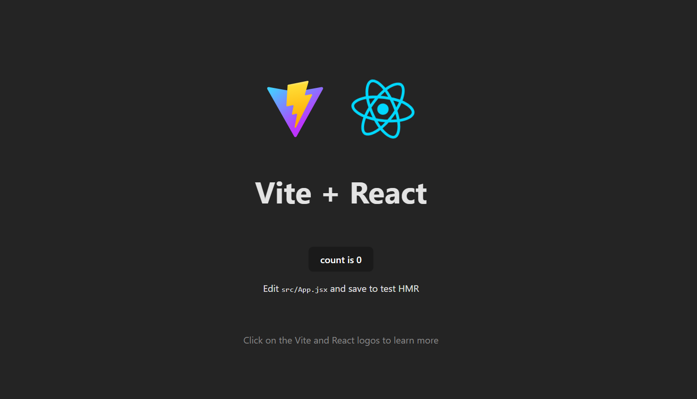

# 📅 Day 02 — React Setup & JSX

### Creating the First React Application

---

## 🔗 Quick Navigation

- [🎯 Goal of the Day](#-goal-of-the-day)
- [🧠 Concepts Refreshed](#-concepts-refreshed)
- [🛠️ What I Built](#️-what-i-built)
- [📁 Folder Structure](#-folder-structure)
- [🧩 How React & JSX Work Together](#-how-react--jsx-work-together)
- [🖼️ Project Preview](#️-project-preview)
- [📝 Notes & Observations](#-notes--observations)
- [💡 Key Takeaways](#-key-takeaways)
- [🎯 Interview Preparation](#-interview-preparation-day-02-level)
- [⏭️ What’s Next?](#️-whats-next)

---

## 🎯 Goal of the Day

The goal of **Day 02** was to **set up a React development environment**, understand **JSX**, and build the **first React application**.

This day focuses on:

- Understanding why React is used
- Learning JSX syntax
- Seeing how React differs from vanilla JavaScript
- Running and modifying a React app

---

## 🧠 Concepts Refreshed

### React Basics

- What React is
- Why React is used for UI development
- Component-based thinking
- How React handles UI rendering

### JSX

- What JSX is
- Why JSX looks like HTML
- Writing JavaScript expressions inside JSX
- JSX rules (single parent, closing tags)

---

## 🛠️ What I Built

I created my **first React application** using a modern React setup.

The app demonstrates:

- JSX syntax
- A basic React component
- Rendering UI using React instead of manual DOM manipulation

📌 No state  
📌 No props  
📌 Only setup and JSX fundamentals

---

## 📁 Folder Structure

Day-02/ 
├─ README.md  
└─ frontend/ 
├─ package.json 
├─ src/ 
│ ├─ App.jsx 
│ └─ main.jsx 
└─ public/

---

## 🧩 How React & JSX Work Together

- React uses components to build UI
- JSX allows writing UI directly inside JavaScript
- JSX is converted to JavaScript behind the scenes
- React updates the UI efficiently

This removes the need for **manual DOM manipulation**.

---

## 🖼️ Project Preview

---

<h2>📝 Notes & Observations</h2>

JSX makes UI code easier to read and manage

React feels different at first but reduces complexity

Understanding setup removes fear of React projects

React focuses on UI, not full application logic

---

<h3>💡 Key Takeaways</h3>

React is a JavaScript library, not a framework

JSX improves readability and developer experience

Components are the foundation of React

Strong basics make advanced React easier

---

<h3>🎯 Interview Preparation (Day 02 Level)</h3>

**Q1. What is React?**

React is a JavaScript library used to build user interfaces using reusable components.

**Q2. What is JSX?**

JSX is a syntax extension that allows writing UI code inside JavaScript.

**Q3. Is JSX mandatory in React?**

No, but JSX makes React code easier to read and write.

**Q4. How is React different from vanilla JavaScript?**

React manages UI using components instead of manual DOM manipulation.

---

## 🔗 Helpful References

🔗 https://react.dev/learn

🔗 https://react.dev/learn/writing-markup-with-jsx

🔗 https://developer.mozilla.org/en-US/docs/Web/JavaScript

---

## ⏭️ What’s Next?

### 👉 **Day 03 – Components & Props**

Learn how to:

- Create React components
- Build reusable UI blocks
- Pass data using props
- Structure React applications cleanly

 

[➡️ Go to Day 03](../Day-03/README.md)

---
