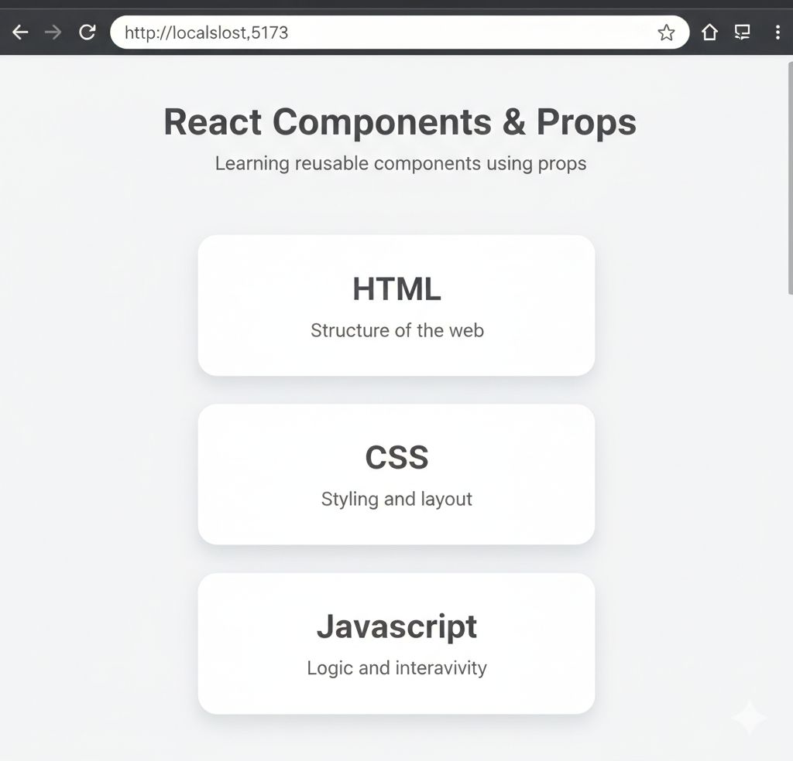

# 📅 Day 03 — React Components & Props

### Building Reusable UI with Component-Based Architecture

---

## 🎯 Goal of the Day

The goal of **Day 03** is to understand **React Components and Props**, which are the **core building blocks** of any React application.

This day focuses on:

- Breaking UI into components
- Making components reusable
- Passing data using props
- Writing clean and scalable React code

---

## 🧠 Concepts Covered

### 🔹 React Components

- Functional components
- JSX return structure
- Component naming rules
- Reusability

### 🔹 Props

- Passing data from parent to child
- Using props inside JSX
- Making UI dynamic
- Read-only nature of props

---

## 🛠️ What I Built

I created a **simple React UI** that demonstrates:

- Multiple reusable components
- Data passed via props
- Clean component hierarchy
- Same component reused with different values

---

## 📁 Folder Structure

Day-03/  
├─ README.md  
├─ notes.md  
└─ frontend/  
&nbsp;&nbsp;&nbsp;&nbsp;├─ src/  
&nbsp;&nbsp;&nbsp;&nbsp;│&nbsp;&nbsp;├─ components/  
&nbsp;&nbsp;&nbsp;&nbsp;│&nbsp;&nbsp;│&nbsp;&nbsp;├─ Card.jsx  
&nbsp;&nbsp;&nbsp;&nbsp;│&nbsp;&nbsp;│&nbsp;&nbsp;└─ Header.jsx  
&nbsp;&nbsp;&nbsp;&nbsp;│&nbsp;&nbsp;├─ App.jsx  
&nbsp;&nbsp;&nbsp;&nbsp;│&nbsp;&nbsp;└─ main.jsx  
&nbsp;&nbsp;&nbsp;&nbsp;└─ package.json

---

## 🧩 How Components & Props Work

- UI is divided into small components
- Parent component sends data using props
- Child component receives and displays data
- Same component behaves differently with different props

This approach makes React apps **scalable and maintainable**.

---

## 🖼️ Project Preview

<<<<<<< Updated upstream

=======

>>>>>>> Stashed changes

---

## 📝 Notes & Observations

- Components improve readability
- Props remove hard-coded values
- Reusability reduces duplication
- Clean structure avoids future confusion

---

## 💡 Key Takeaways

- Everything in React is a component
- Props enable component communication
- Reusability is React’s biggest strength
- Clean fundamentals matter more than libraries

---

## 🎯 Interview Preparation (Day 03 Level)

**Q1. What is a React component?**  
A reusable JavaScript function that returns JSX.

**Q2. What are props?**  
Props are inputs passed from parent to child components.

**Q3. Can props be changed inside a component?**  
No, props are read-only.

**Q4. Why are components important?**  
They improve reusability, readability, and maintainability.

---

## 🔗 Helpful References

- https://react.dev/learn/your-first-component
- https://react.dev/learn/passing-props-to-a-component

---

## ⏭️ What’s Next?

### 👉 **Day 04 – State & Event Handling**

Learn how to:

- Use `useState`
- Handle events
- Build interactive React apps

 

[➡️ Go to Day 04](../Day-04/README.md)

---
