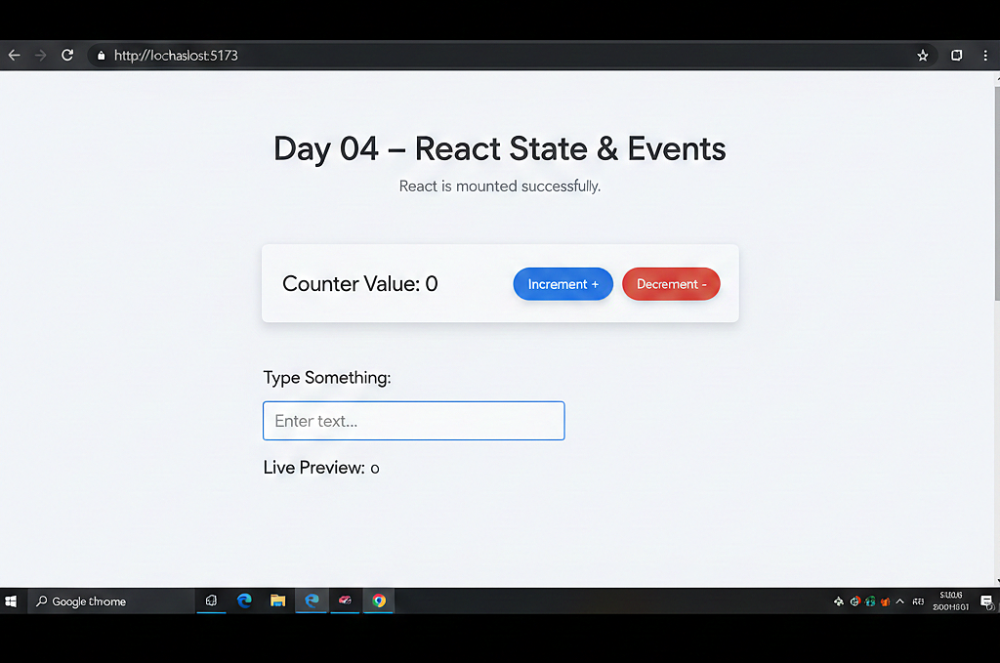

# 📅 Day 04 — React State & Event Handling

### Making React Applications Interactive

---

## 🎯 Goal of the Day

The goal of **Day 04** is to understand **State and Event Handling in React**, which makes applications **dynamic and interactive**.

This day focuses on:

- Understanding what state is
- Managing state using `useState`
- Handling user interactions
- Updating UI dynamically

---

## 🧠 Concepts Covered

### 🔹 React State

- What is state
- Why state is required
- Difference between state and props
- Component re-rendering

### 🔹 useState Hook

- Declaring state
- Updating state
- Initial state values

### 🔹 Event Handling

- Handling click events
- Handling input events
- Controlled components

---

## 🛠️ What I Built

I built **simple interactive React components** that demonstrate:

- A counter using state
- Button click handling
- Input field with live state updates
- Automatic UI re-rendering

---

## 📁 Folder Structure

Day-04/  
├─ README.md  
├─ notes.md  
└─ frontend/  
&nbsp;&nbsp;&nbsp;&nbsp;├─ src/  
&nbsp;&nbsp;&nbsp;&nbsp;│&nbsp;&nbsp;├─ components/  
&nbsp;&nbsp;&nbsp;&nbsp;│&nbsp;&nbsp;│&nbsp;&nbsp;├─ Counter.jsx  
&nbsp;&nbsp;&nbsp;&nbsp;│&nbsp;&nbsp;│&nbsp;&nbsp;└─ InputBox.jsx  
&nbsp;&nbsp;&nbsp;&nbsp;│&nbsp;&nbsp;├─ App.jsx  
&nbsp;&nbsp;&nbsp;&nbsp;│&nbsp;&nbsp;└─ main.jsx  
&nbsp;&nbsp;&nbsp;&nbsp;└─ package.json

---

## 🧩 How State & Events Work

- State stores dynamic data
- User events trigger state updates
- State changes cause re-rendering
- UI reflects the latest state

This is how React handles **interactivity** efficiently.

---

## 🖼️ Project Preview

---

## 📝 Notes & Observations

- State makes React dynamic
- `useState` simplifies state management
- Event handling connects UI and logic
- Clean state usage avoids bugs

---

## 💡 Key Takeaways

- State controls UI behavior
- Hooks power modern React
- Events drive user interaction
- Fundamentals matter more than libraries

---

## 🎯 Interview Preparation (Day 04 Level)

**Q1. What is state in React?**  
State is data that can change over time and affects component rendering.

**Q2. What is `useState`?**  
A React hook used to manage state in functional components.

**Q3. Difference between props and state?**  
Props are passed from parent, state is managed inside the component.

**Q4. Why should state not be modified directly?**  
Direct modification does not trigger re-rendering.

---

## 🔗 Helpful References

- https://react.dev/learn/state-a-components-memory
- https://react.dev/learn/responding-to-events

---

## ⏭️ What’s Next?

### 👉 **Day 05 – Conditional Rendering & Lists**

Learn how to:

- Render UI conditionally
- Display lists using `map()`
- Use keys in React lists

 

[➡️ Go to Day 05](../Day-05/README.md)

---
