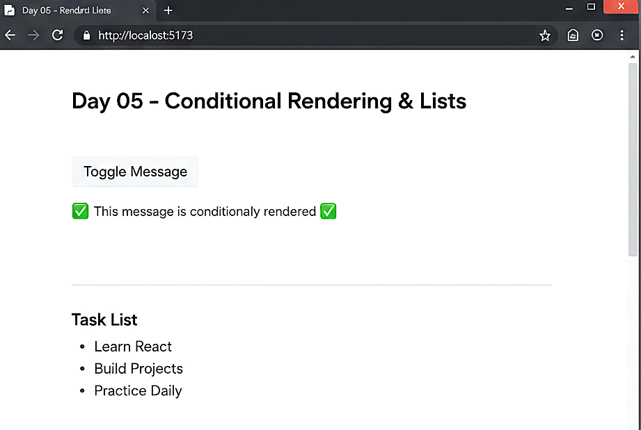

# 📅 Day 05 — Conditional Rendering & Lists

### Making React UI Dynamic

---

## 🎯 Goal of the Day

The goal of **Day 05** is to understand how React renders UI dynamically using **Conditional Rendering and Lists**.

This day focuses on:

- Rendering UI based on conditions
- Showing and hiding elements
- Rendering lists using `map()`
- Understanding the importance of keys

---

## 🧠 Concepts Covered

### 🔹 Conditional Rendering

- Rendering UI based on conditions
- Using ternary operators
- Using logical AND (`&&`)
- Why JSX only supports expressions

### 🔹 Rendering Lists

- Using `map()` to render arrays
- Dynamic UI generation
- Iterating over data

### 🔹 Keys in React

- Why keys are important
- Unique identification of elements
- Best practices for keys

---

## 🛠️ What I Built

I built **simple dynamic components** that demonstrate:

- A toggle button to show/hide content
- Conditional message rendering
- A dynamic task list
- List rendering using `map()`
- Proper usage of unique keys

---

## 📁 Folder Structure

Day-05/  
├─ README.md  
├─ notes.md  
└─ frontend/  
&nbsp;&nbsp;&nbsp;&nbsp;├─ src/  
&nbsp;&nbsp;&nbsp;&nbsp;│&nbsp;&nbsp;├─ components/  
&nbsp;&nbsp;&nbsp;&nbsp;│&nbsp;&nbsp;│&nbsp;&nbsp;├─ Toggle.jsx  
&nbsp;&nbsp;&nbsp;&nbsp;│&nbsp;&nbsp;│&nbsp;&nbsp;└─ TaskList.jsx  
&nbsp;&nbsp;&nbsp;&nbsp;│&nbsp;&nbsp;├─ App.jsx  
&nbsp;&nbsp;&nbsp;&nbsp;│&nbsp;&nbsp;└─ main.jsx  
&nbsp;&nbsp;&nbsp;&nbsp;└─ package.json

---

## 🧩 How Conditional Rendering & Lists Work

- React evaluates JavaScript expressions inside JSX
- Conditions determine what gets rendered
- `map()` transforms arrays into UI elements
- Keys help React efficiently update elements

This is how React creates **dynamic and scalable interfaces**.

---

## 🖼️ Project Preview

---

## 📝 Notes & Observations

- JSX does not allow statements like `if` directly
- Ternary operator is best for inline conditions
- Keys must be unique and stable
- Dynamic rendering improves user experience

---

## 💡 Key Takeaways

- Conditional rendering makes UI responsive
- Lists are rendered using `map()`
- Keys improve performance and stability
- Understanding fundamentals prevents common bugs

---

## 🎯 Interview Preparation (Day 05 Level)

**Q1. What is conditional rendering in React?**  
It is rendering UI elements based on certain conditions.

**Q2. How do you render a list in React?**  
By using the `map()` function to transform an array into JSX elements.

**Q3. Why are keys important in React lists?**  
Keys help React identify which items have changed, added, or removed.

**Q4. Can we use index as a key?**  
It is not recommended if the list can change dynamically.

---

## 🔗 Helpful References

- https://react.dev/learn/conditional-rendering
- https://react.dev/learn/rendering-lists

---

## ⏭️ What’s Next?

### 👉 **Day 06 – Forms & Controlled Components**

Learn how to:

- Handle form inputs
- Manage multiple input states
- Build controlled components

 

[➡️ Go to Day 06](../Day-06/README.md)

---
