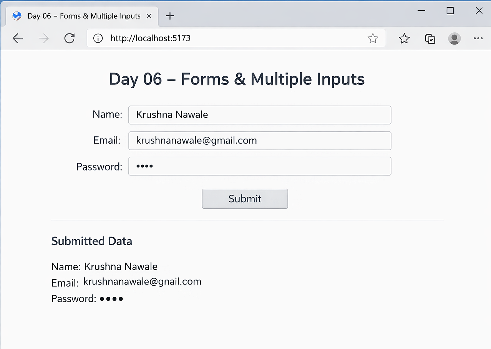

# 📅 Day 06 — Forms & Multiple Inputs

### Handling User Input in React Applications

---

## 🎯 Goal of the Day

The goal of **Day 06** is to understand how to handle **forms and multiple input fields in React** using controlled components.

This day focuses on:

- Managing form inputs using state
- Handling multiple input fields
- Creating controlled components
- Submitting form data properly

---

## 🧠 Concepts Covered

### 🔹 Controlled Components

- Inputs controlled by React state
- Using `value` and `onChange`
- Keeping UI and state in sync

### 🔹 Handling Multiple Inputs

- Managing multiple fields in one state object
- Updating state dynamically
- Using `name` attribute for input handling

### 🔹 Form Submission

- Handling form `onSubmit`
- Preventing default behavior
- Accessing submitted data

---

## 🛠️ What I Built

I built **a simple form component** that demonstrates:

- Multiple input fields (name, email, password)
- Controlled input handling
- Dynamic state updates
- Form submission handling
- Displaying submitted data on the screen

---

## 📁 Folder Structure

Day-06/  
├─ README.md  
├─ notes.md  
└─ frontend/  
&nbsp;&nbsp;&nbsp;&nbsp;├─ src/  
&nbsp;&nbsp;&nbsp;&nbsp;│&nbsp;&nbsp;├─ components/  
&nbsp;&nbsp;&nbsp;&nbsp;│&nbsp;&nbsp;│&nbsp;&nbsp;├─ Form.jsx  
&nbsp;&nbsp;&nbsp;&nbsp;│&nbsp;&nbsp;│&nbsp;&nbsp;└─ Display.jsx  
&nbsp;&nbsp;&nbsp;&nbsp;│&nbsp;&nbsp;├─ App.jsx  
&nbsp;&nbsp;&nbsp;&nbsp;│&nbsp;&nbsp;└─ main.jsx  
&nbsp;&nbsp;&nbsp;&nbsp;└─ package.json

---

## 🧩 How Forms Work in React

- Input values are stored in state
- `onChange` updates state on every keystroke
- Form submission is handled using `onSubmit`
- `event.preventDefault()` prevents page reload
- Controlled components ensure predictable behavior

This is how React manages **form data efficiently**.

---

## 🖼️ Project Preview

---

## 📝 Notes & Observations

- Controlled components give full control over form data
- Managing multiple inputs is easier using a single state object
- `name` attribute helps identify which input changed
- Preventing default form submission is important

---

## 💡 Key Takeaways

- Forms are controlled using state
- `onChange` keeps UI synchronized with state
- Multiple inputs can be handled dynamically
- Proper form handling prevents unexpected behavior

---

## 🎯 Interview Preparation (Day 06 Level)

**Q1. What is a controlled component in React?**  
A component where form input values are controlled by React state.

**Q2. How do you handle multiple input fields in React?**  
By storing them in a single state object and updating using the `name` attribute.

**Q3. Why do we use `event.preventDefault()` in forms?**  
To prevent the page from reloading on form submission.

**Q4. What happens if an input does not have a `value` attribute?**  
It becomes an uncontrolled component.

---

## 🔗 Helpful References

- https://react.dev/learn/sharing-state-between-components
- https://react.dev/learn/managing-state

---

## ⏭️ What’s Next?

### 👉 **Day 07 – useEffect Hook**

Learn how to:

- Handle side effects
- Fetch data
- Run code on component mount
- Control re-renders

 

[➡️ Go to Day 07](../Day-07/README.md)

---
