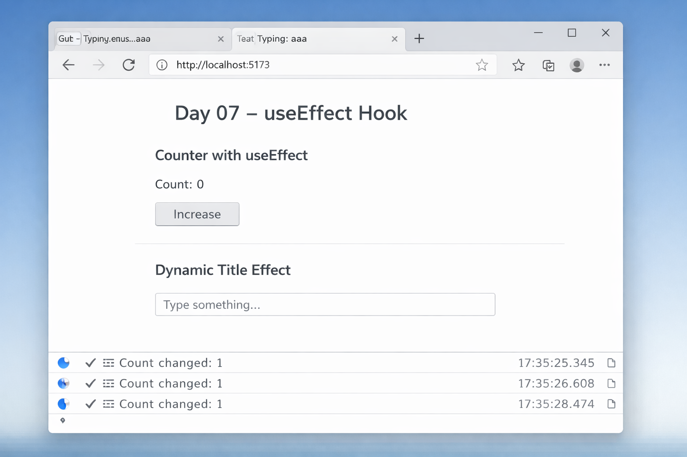

# 📅 Day 07 — useEffect Hook

### Managing Side Effects in React

---

## 🎯 Goal of the Day

The goal of **Day 07** is to understand the **useEffect Hook**, which is used to handle side effects in React applications.

This day focuses on:

- What side effects are
- Using `useEffect`
- Dependency array behavior
- Component lifecycle in functional components

---

## 🧠 Concepts Covered

### 🔹 What is useEffect?

- A React Hook used to handle side effects
- Runs after component render
- Replaces lifecycle methods in functional components

### 🔹 Dependency Array

- Empty dependency array `[]`
- No dependency array
- Specific dependencies `[value]`
- Controlling when effect runs

### 🔹 Side Effects in React

- Fetching data
- Updating document title
- Timers
- Logging
- API calls

---

## 🛠️ What I Built

I built **simple examples demonstrating useEffect behavior**, including:

- Running effect on component mount
- Running effect on state change
- Updating document title dynamically
- Understanding re-render cycles

---

## 📁 Folder Structure

Day-07/  
├─ README.md  
├─ notes.md  
└─ frontend/  
&nbsp;&nbsp;&nbsp;&nbsp;├─ src/  
&nbsp;&nbsp;&nbsp;&nbsp;│&nbsp;&nbsp;├─ components/  
&nbsp;&nbsp;&nbsp;&nbsp;│&nbsp;&nbsp;│&nbsp;&nbsp;├─ CounterEffect.jsx  
&nbsp;&nbsp;&nbsp;&nbsp;│&nbsp;&nbsp;│&nbsp;&nbsp;└─ TitleEffect.jsx  
&nbsp;&nbsp;&nbsp;&nbsp;│&nbsp;&nbsp;├─ App.jsx  
&nbsp;&nbsp;&nbsp;&nbsp;│&nbsp;&nbsp;└─ main.jsx  
&nbsp;&nbsp;&nbsp;&nbsp;└─ package.json

---

## 🧩 How useEffect Works

- React renders component
- After render, `useEffect` runs
- Dependency array controls execution
- Cleanup function runs before next effect (if defined)

This is how React manages **side effects efficiently**.

---

## 🖼️ Project Preview

---

## 📝 Notes & Observations

- `useEffect` runs after render
- Empty array means run once (on mount)
- No array means run on every render
- Dependencies control re-execution
- Cleanup prevents memory leaks

---

## 💡 Key Takeaways

- useEffect handles side effects
- Dependency array is very important
- React lifecycle can be managed with hooks
- Clean effects improve performance

---

## 🎯 Interview Preparation (Day 07 Level)

**Q1. What is useEffect in React?**  
A Hook that allows you to perform side effects in functional components.

**Q2. What happens if dependency array is empty?**  
The effect runs only once after initial render.

**Q3. What happens if no dependency array is provided?**  
The effect runs after every render.

**Q4. What is a cleanup function in useEffect?**  
A function returned from useEffect that runs before the next effect or when component unmounts.

---

## 🔗 Helpful References

- https://react.dev/reference/react/useEffect
- https://react.dev/learn/synchronizing-with-effects

---

## ⏭️ What’s Next?

### 👉 **Day 08 – API Fetching with useEffect**

Learn how to:

- Fetch data from APIs
- Handle loading states
- Handle errors
- Render fetched data dynamically

 

[➡️ Go to Day 08](../Day-08/README.md)

---
