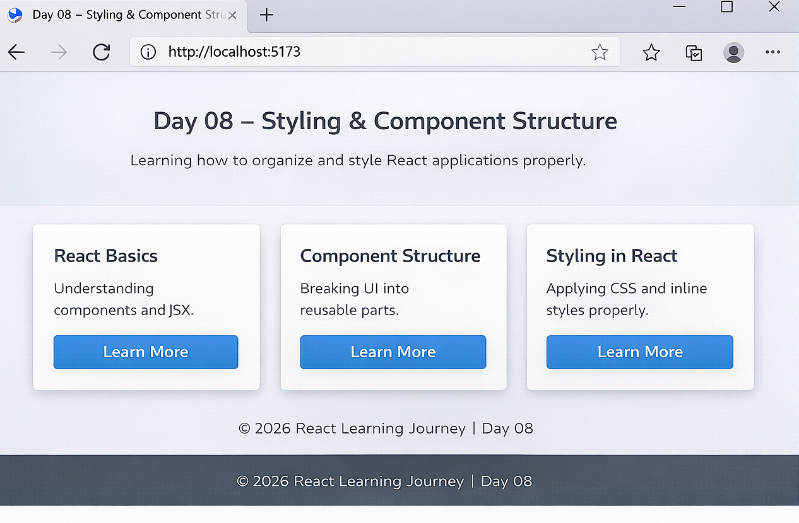

# 📅 Day 08 — Styling & Component Structure

### Organizing React Components & Applying Styling Properly

---

## 🎯 Goal of the Day

The goal of **Day 08** was to understand **how styling works in React** and how to properly **structure components for clean and scalable projects**.

This day focuses on:

- Organizing components properly
- Separating UI into reusable parts
- Applying CSS in React
- Writing cleaner project structure

---

## 🧠 Concepts Learned

### Styling in React

- Inline Styling
- CSS Stylesheets
- ClassName usage
- Dynamic styling based on state

### Component Structure

- Breaking UI into smaller components
- Folder organization
- Reusable components
- Clean separation of concerns

---

## 🛠️ What I Built

I created a **React UI project** demonstrating:

- Multiple structured components
- Clean folder hierarchy
- Styled components using CSS
- Reusable UI sections

The focus was not just UI — but writing **clean and maintainable React code**.

---

## 📁 Folder Structure

Day-08/ 
├─ README.md  
└─ frontend/ 
&nbsp;&nbsp;&nbsp;&nbsp;├─ src/ 
&nbsp;&nbsp;&nbsp;&nbsp;│&nbsp;&nbsp;&nbsp;&nbsp;├─ components/ 
&nbsp;&nbsp;&nbsp;&nbsp;│&nbsp;&nbsp;&nbsp;&nbsp;│&nbsp;&nbsp;&nbsp;&nbsp;├─ Header.jsx 
&nbsp;&nbsp;&nbsp;&nbsp;│&nbsp;&nbsp;&nbsp;&nbsp;│&nbsp;&nbsp;&nbsp;&nbsp;├─ Card.jsx 
&nbsp;&nbsp;&nbsp;&nbsp;│&nbsp;&nbsp;&nbsp;&nbsp;│&nbsp;&nbsp;&nbsp;&nbsp;└─ Footer.jsx 
&nbsp;&nbsp;&nbsp;&nbsp;│&nbsp;&nbsp;&nbsp;&nbsp;├─ App.jsx 
&nbsp;&nbsp;&nbsp;&nbsp;│&nbsp;&nbsp;&nbsp;&nbsp;└─ style.css 
&nbsp;&nbsp;&nbsp;&nbsp;└─ index.html 

---

## 🧩 Why Component Structure Matters

- Improves readability
- Makes code reusable
- Easier debugging
- Scalable for large projects

React applications grow fast — clean structure prevents chaos.

---

## 🖼️ Project Preview

<h2>📝 Notes & Observations</h2>

Styling should not be mixed randomly inside components

Reusable components reduce code duplication

Folder structure improves long-term maintainability

Clean structure makes collaboration easier

<h3>💡 Key Takeaways</h3>

React projects must be organized early

Small components are better than one large file

CSS separation improves clarity

Structure is as important as logic

<h3>>🎯 Interview Preparation (Day 08 Level)</h3>
                                             
Q1. What are different ways to style a React component?

Inline styles, external CSS files, CSS modules, and styled-components.

Q2. Why break UI into components?

To improve reusability, readability, and maintainability.

Q3. What is the benefit of reusable components?

They reduce duplication and make scaling easier.

Q4. What is separation of concerns in React?

Keeping logic, structure, and styling properly organized.

🔗 Helpful References

🔗 https://react.dev/learn

🔗 https://developer.mozilla.org/en-US/docs/Web/CSS

🔗 https://react.dev/learn/sharing-state-between-components

## ⏭️ What’s Next?

### 👉 **Day 09 – Props in Depth**

Learn how:

- Passing data between components
- Understanding parent-child relationship
- Reusable dynamic components
- Component communication

 

[➡️ Go to Day 09](../Day-09/README.md)

---
