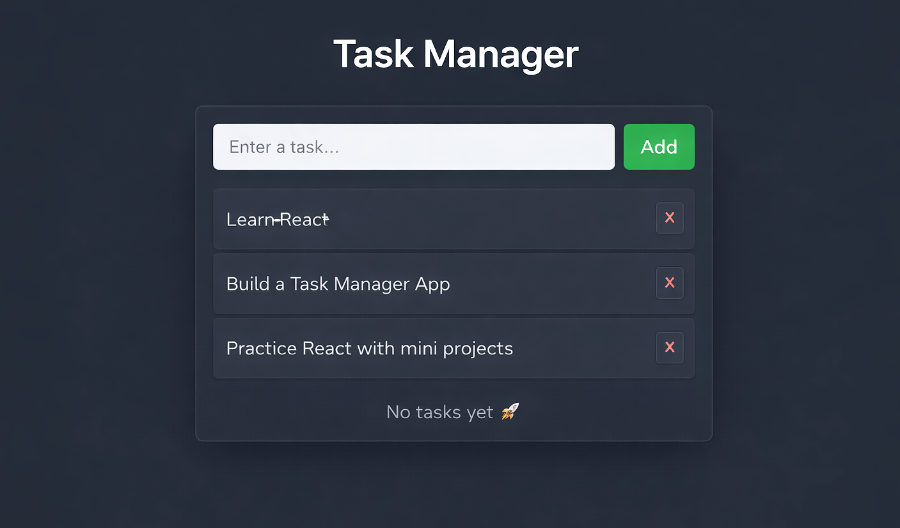

# 📅 Day 09 — Mini React Project

### Applying Core React Concepts into a Real Project

---

## 🎯 Goal of the Day

The goal of **Day 09** was to **build a complete mini React project** by combining everything learned so far.

This day focuses on:

- Thinking in components
- Managing state properly
- Handling user interaction
- Structuring a real project

---

## 🧠 Concepts Used

### React Fundamentals

- Components
- Props
- useState
- Event handling
- Conditional rendering
- Lists & keys

### Project Architecture

- Component folder structure
- Clean UI separation
- Reusable components
- Styling integration

---

## 🛠️ What I Built

I built a **fully functional mini React application** that demonstrates:

- Multiple reusable components
- Dynamic UI updates
- State-driven rendering
- User interaction handling
- Clean and scalable folder structure

This project represents my **first real step from learning → building**.

---

## 📁 Folder Structure

Day-09/ 
├─ README.md  
├─ notes.md  
└─ frontend/ 
&nbsp;&nbsp;&nbsp;&nbsp;├─ src/ 
&nbsp;&nbsp;&nbsp;&nbsp;│&nbsp;&nbsp;├─ components/ 
&nbsp;&nbsp;&nbsp;&nbsp;│&nbsp;&nbsp;│&nbsp;&nbsp;├─ Header.jsx 
&nbsp;&nbsp;&nbsp;&nbsp;│&nbsp;&nbsp;│&nbsp;&nbsp;├─ Form.jsx 
&nbsp;&nbsp;&nbsp;&nbsp;│&nbsp;&nbsp;│&nbsp;&nbsp;├─ List.jsx 
&nbsp;&nbsp;&nbsp;&nbsp;│&nbsp;&nbsp;│&nbsp;&nbsp;└─ Item.jsx 
&nbsp;&nbsp;&nbsp;&nbsp;│&nbsp;&nbsp;├─ App.jsx 
&nbsp;&nbsp;&nbsp;&nbsp;│&nbsp;&nbsp;├─ style.css 
&nbsp;&nbsp;&nbsp;&nbsp;│&nbsp;&nbsp;└─ main.jsx 
&nbsp;&nbsp;&nbsp;&nbsp;└─ package.json

---

## 🧩 How the Project Works

- UI is divided into small reusable components
- State is managed in the parent component
- Data flows using props
- Events update the state
- UI re-renders automatically

This is the **core workflow of real React applications**.

---

## 🖼️ Project Preview

<h2>📝 Notes & Observations</h2>

Building a real project improves confidence

Combining concepts gives deeper clarity

Component structure becomes natural with practice

State management is the heart of React apps

<h3>💡 Key Takeaways</h3>

Learning syntax is not enough — building is required

Project-based learning makes concepts permanent

Clean structure is as important as functionality

This is the transition from beginner → developer mindset

<h3>>🎯 Interview Preparation (Day 09 Level)</h3>

Q1. Why are mini projects important in React learning?

Mini projects help in applying multiple concepts together in a real scenario.

Q2. Where should state be managed?

In the closest common parent of the components that need the data.

Q3. How does data flow in React?

Unidirectional — from parent to child using props.

Q4. Why break UI into components?

For reusability, maintainability, and scalability.

🔗 Helpful References

🔗 https://react.dev/learn

🔗 https://react.dev/learn/thinking-in-react

🔗 https://react.dev/learn/sharing-state-between-components

## ⏭️ What’s Next?

### 👉 **Day 10 – API Integration & useEffect Practice**

Learn how:

- Fetch data from APIs
- Handle loading states
- Display dynamic backend data
- Connect React with real-world data

 

[➡️ Go to Day 10](../Day-10/README.md)

---
