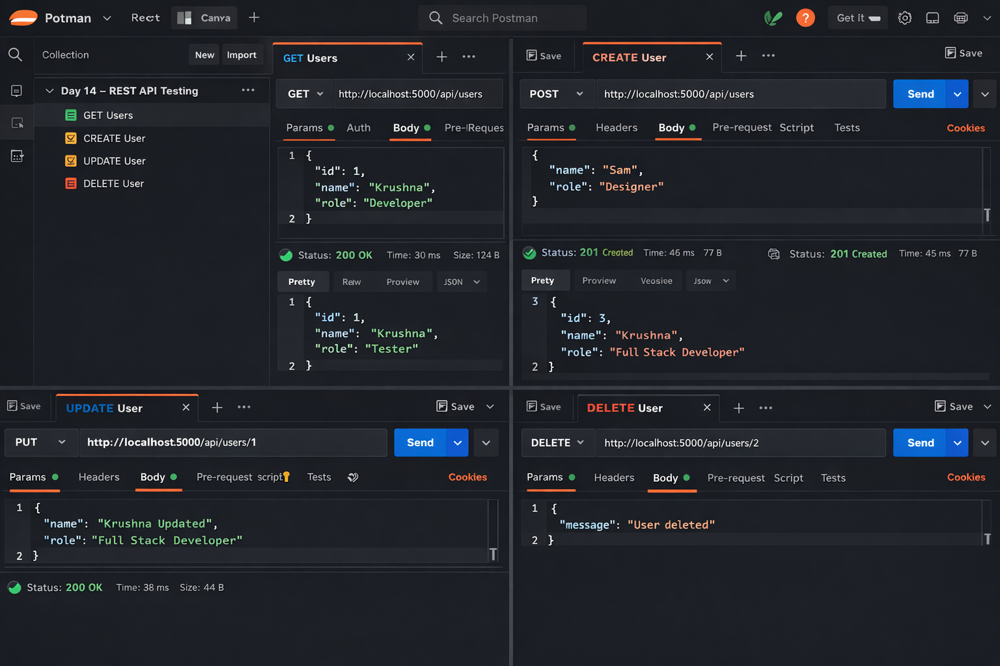

# 📅 Day 14 — Postman Testing

### Testing REST APIs Like a Backend Developer

---

## 🎯 Goal of the Day

The goal of **Day 14** was to **test and validate REST APIs using Postman**, ensuring that each endpoint works correctly.

This day focuses on:

- Understanding API testing workflow
- Sending different HTTP requests
- Validating request & response data
- Debugging backend using Postman

---

## 🧠 Concepts Used

### API Testing Fundamentals

- What is Postman
- Why API testing is important
- Client → Server request flow
- Status code validation

### HTTP Methods Testing

- GET → Fetch data
- POST → Create data
- PUT → Update data
- DELETE → Remove data

### Request & Response Handling

- Sending JSON body
- Params & route variables
- Response validation
- Error handling

---

## 🛠️ What I Did

I tested the **REST API built on Day 13** using Postman:

- Sent all CRUD requests
- Verified status codes
- Sent JSON request body
- Checked API responses
- Debugged incorrect routes

This simulates **real backend development workflow**.

---

## 📁 Folder Structure

Day-14/ 
├─ README.md  
├─ notes.md  
└─ postman/ 
&nbsp;&nbsp;&nbsp;&nbsp;└─ day-14-postman-collection.json

---

## 🧩 API Testing Workflow

- Start the backend server
- Open Postman
- Select HTTP method
- Enter API endpoint
- Send request
- Verify response

This ensures the API is **working before connecting it to the frontend**.

---

## 🖼️ Project Preview

<h2>📝 Notes & Observations</h2>

Testing APIs separately makes debugging easier

Status codes help in identifying issues quickly

Postman improves backend development speed

Proper request structure is very important

<h3>💡 Key Takeaways</h3>

API testing is a core backend skill

Always test APIs before frontend integration

Understanding responses improves debugging

Postman is an industry-standard tool

<h3>>🎯 Interview Preparation (Day 14 Level)</h3>

Q1. What is Postman?

Postman is an API client used to test, develop, and document APIs.

Q2. Why is API testing required?

To verify endpoints, validate data, and debug issues before frontend integration.

Q3. What is a status code?

A server response code that indicates the result of an API request.

Q4. Difference between 200 and 201?

200 → Successful request  
201 → Resource created successfully

🔗 Helpful References

🔗 https://www.postman.com/api-platform/api-testing/

🔗 https://developer.mozilla.org/en-US/docs/Web/HTTP/Status

🔗 https://learning.postman.com/docs/getting-started/introduction/

## ⏭️ What’s Next?

### 👉 **Day 15 – MongoDB & Mongoose Integration**

Learn how:

- Connect Node.js with MongoDB
- Define Mongoose schemas
- Store API data in database
- Perform database CRUD operations

 

[➡️ Go to Day 15](../Day-15/README.md)

---
